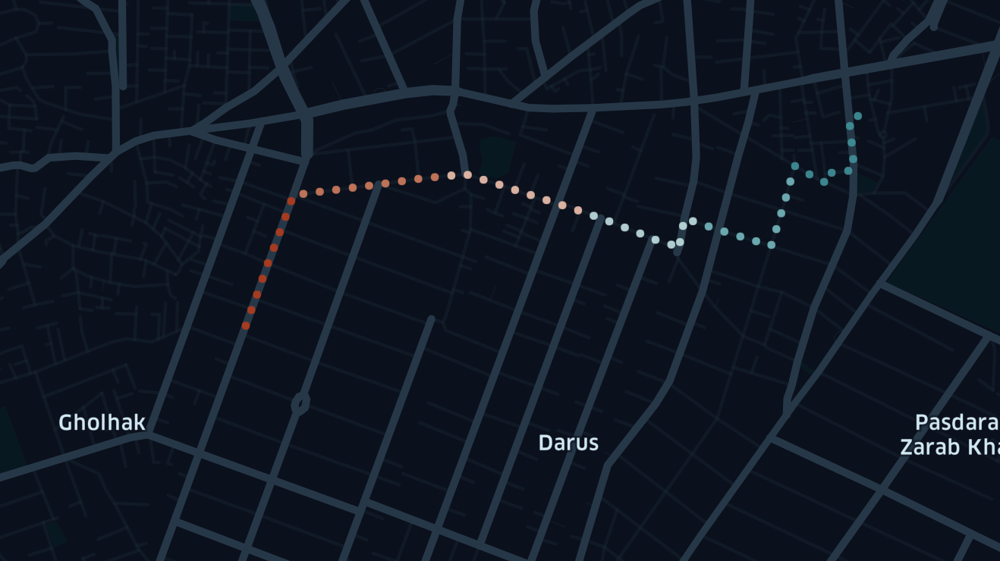

# Artificial Intelligence
This repository was made for documenting the practical assignments and final project of the CE417: Artificial Intellignece course.
I will be uploading my answers to the assignments as they get released throughout the semester.

## Homeworks
You can find the homework assignments in their respective folders: [HW1](https://github.com/Sinanmz/ArtificialIntelligence/tree/main/F2023-HW1), [HW2](https://github.com/Sinanmz/ArtificialIntelligence/tree/main/F2023-HW1), [HW3](https://github.com/Sinanmz/ArtificialIntelligence/tree/main/F2023-HW1), and [HW4](https://github.com/Sinanmz/ArtificialIntelligence/tree/main/F2023-HW1).

## Final Project
The final project details can be found in the [Final Project](https://github.com/Sinanmz/ArtificialIntelligence/tree/main/Final_Project) folder.

